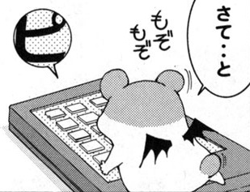

# Exploiting Aliasing for Manga Restoration
### [CVPR Paper](https://openaccess.thecvf.com/content/CVPR2021/html/Xie_Exploiting_Aliasing_for_Manga_Restoration_CVPR_2021_paper.html) | [Arxiv](https://arxiv.org/abs/2105.06830) | [Project Website](http://www.cse.cuhk.edu.hk/~ttwong/papers/mangarestore/mangarestore.html) | [BibTex](#citation) 

<!-- ------------------------------------------------------------------------------ -->
## Introduction 
As a popular entertainment art form, manga enriches the line drawings details with bitonal screentones. However, manga resources over the Internet usually show screentone artifacts because of inappropriate scanning/rescaling resolution. In this paper, we propose an innovative two-stage method to restore quality bitonal manga from degraded ones. Our key observation is that the aliasing induced by downsampling bitonal screentones can be utilized as informative clues to infer the original resolution and screentones. First, we predict the target resolution from the degraded manga via the Scale Estimation Network (SE-Net) with spatial voting scheme. Then, at the target resolution, we restore the region-wise bitonal screentones via the Manga Restoration Network (MR-Net) discriminatively, depending on the degradation degree. Specifically, the original screentones are directly restored in pattern-identifiable regions, and visually plausible screentones are synthesized in pattern-agnostic regions. Quantitative evaluation on synthetic data and visual assessment on real-world cases illustrate the effectiveness of our method.

<!-- ------------------------------------------------------------------------------ -->
## Example Results 
Belows shows an example of our restored manga image. The image comes from the [Manga109 dataset](http://www.manga109.org/en/).




<!-- ------------------------------------------------------------------- -->
## Pretrained models
Download the models below and put it under `release_model/`.

[MangaRestoration](https://drive.google.com/file/d/1sazt7jlvfR6KEjOp9Tq2GpjMe04uRgtn/view?usp=sharing) 

<!-- -------------------------------------------------------- -->
## Run 
1. Requirements:
    * Install python3.6
    * Install [pytorch](https://pytorch.org/) (tested on Release 1.1.0)
    * Install python requirements:
    ```bash
       pip install -r requirements.txt
    ```
2. Testing:
    * Place your test images under [datazip/manga1/test](datazip/manga1/test).

    * Prepare images filelist using [flist.py](scripts/flist.py).
    * Run `python scripts/flist.py --path path_to_test_set --output path_to_test_flist `. 
    * For example, `python scripts/flist.py --path datazip/manga1/test --output flist/manga1/test.flist `

    * Modify [manga.json](configs/manga.json) to set path to data.
    * Run `python testreal.py -c [config_file] -n [model_name] -s [image_size] `. 
    * For example, `python testreal.py -c configs/manga.json -n resattencv -s 256 `
    * Note that the Convex interpolation refinement requires large GPU memory, you can enable it by setting (bilinear=False) in MangaRestorator to restore images. Defaultly, we set bilinear=True.
    * You can also use `python testreal.py -c [config_file] -n [model_name] -s [image_size] -sl [scale]` to specify the scale factor. 

<!-- ------------------------------------------------------------------- -->
## Citation
If any part of our paper and code is helpful to your work, please generously cite with:
```
@inproceedings{xie2021exploiting,
  author = {Minshan Xie and Menghan Xia and Tien-Tsin Wong},
  title = {Exploiting Aliasing for Manga Restoration},
  booktitle = {The IEEE Conference on Computer Vision and Pattern Recognition},
  year = {2021},
  pages = {13405--13414}
}
```

## Reference
- [PEN-Net](https://github.com/researchmm/PEN-Net-for-Inpainting)
- [ResidualAttentionNetwork](https://github.com/tengshaofeng/ResidualAttentionNetwork-pytorch)
